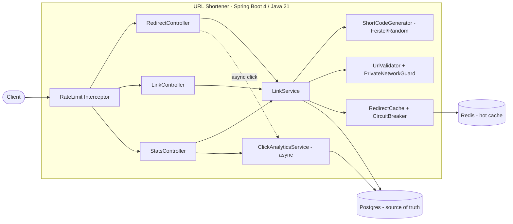

# Architecture Overview

## Components

## Layering (package-by-feature)

- `link/` — the core domain: `LinkController`, `RedirectController`, `LinkService`, `Link`
  entity/repository, `UrlValidator`, `PrivateNetworkGuard`, `RedirectCache`, and `codec/`
  (the `ShortCodeGenerator` strategy: `Feistel*` and `Random*`, `Base62`, `CodeSequence`).
- `analytics/` — `ClickAnalyticsService` (async capture + aggregation), `ClickEvent`,
  `StatsController`, `ClickRetentionSweeper`.
- `common/` — cross-cutting: `error/` (RFC 9457 problem+json), `security/` (management tokens),
  `resilience/` (circuit breaker), `ratelimit/`, `metrics/`, `logging/`.
- `config/` — typed `AppProperties`, `Clock`, async/scheduling, web (interceptor registration).

## Control flow

**Create** `POST /api/v1/links` → rate-limit → validate URL (scheme allowlist + private-network
guard) → validate expiry → issue management token → generate code (or use alias) →
`saveAndFlush`; a unique-index violation means alias-taken (409) or a generated collision
(retry). Returns 201 with the short URL and a one-time management token.

**Redirect** `GET /{code}` → `RedirectCache` lookup → on hit, 302 immediately; on miss, load
from Postgres, check expiry (410 if expired, 404 if unknown, negative-cache the miss), cache the
URL with a TTL **bounded by the link's remaining lifetime**, 302. A successful redirect fires an
**async** click capture. Redis failures degrade to the DB via a circuit breaker.

**Stats** `GET /api/v1/links/{code}/stats?days=N` → verify the link exists (404 otherwise) →
aggregate `click_events` (total, unique salted-IP hashes, per-UTC-day, top referrers).

## Key decisions (see ADRs)

| Decision | Where |
|---|---|
| Java 21 + Spring Boot 4, Postgres + Redis, virtual threads | [ADR-0001](adr/0001-stack-and-storage.md) |
| Sequence + Feistel codes (collision-free, non-sequential); DB stays the arbiter | [ADR-0002](adr/0002-short-code-generation.md) |
| Cache-aside with graceful degradation + TTL bounded by expiry | [ADR-0003](adr/0003-cache-aside-degradation.md) |
| Analytics: click = 302, async capture, salted-IP uniqueness | [ADR-0004](adr/0004-analytics-click-model.md) |

## Cross-cutting concerns

- **Errors:** every failure is RFC 9457 `application/problem+json` via one `@RestControllerAdvice`.
- **Config:** all knobs under `app.*` in a typed `AppProperties` record, env-overridable.
- **Time:** an injected `Clock` everywhere time matters, so expiry/TTL/rate-limit logic is
  deterministically testable.
- **Observability:** Actuator + Micrometer/Prometheus, domain counters, request-id correlation.
- **Security:** scheme allowlist + SSRF guard, per-link capability tokens (hashed), rate limiting.

## Tools & execution approach

Built AI-assisted with disciplined, phase-by-phase execution — each phase is task-specified
(intent/constraints/acceptance criteria), implemented, tested (unit + Testcontainers), gated,
and committed separately. The AI-assisted workflow itself is auditable in
[AI_TRACEABILITY.md](AI_TRACEABILITY.md); build/quality tooling is in [TESTING.md](TESTING.md).
